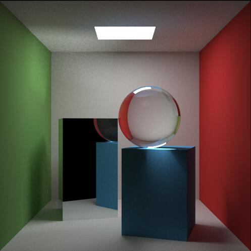
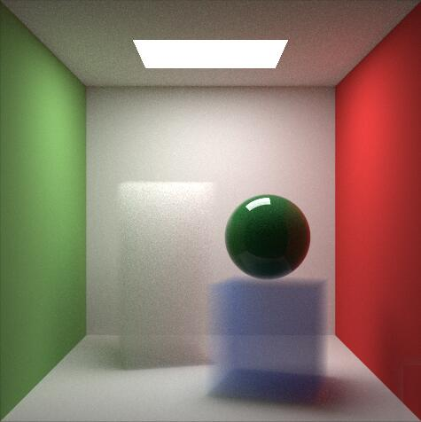
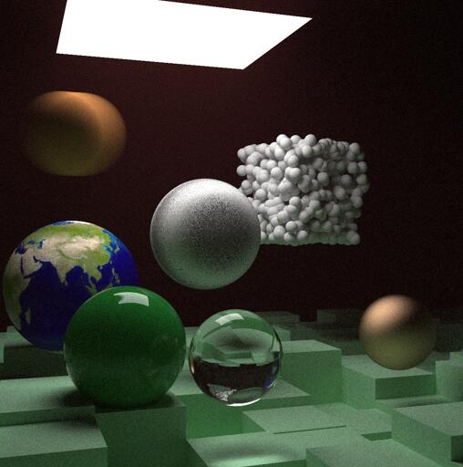

# ToyRayTracer

ToyRayTracer is a path tracer practice writing in c++11.  Most of the implementation referred to Ray Tracing In One Weekend Series which is a great tutorial. The main features are listed below:

- Monte Carlo Path Tracing
- Importance sampling
- Glass, Metal, Lambertian materials
- Multithread
- ...

More light transport methods and variance reduction techniques will be added in the future...

## Usage

The pre-built file is provided in binaries folder, you can run it directly. Or you can open the ToyRayTracer.sln with Visual Studio 2017 or later to see more details of the code. 

I will add a cmakelists file later.

## Screenshots

**Glass and Metal:**

**Volume:**

**Next Weekend Final Scene:**

## Reference

[Ray Tracing In One Weekend Series](https://raytracing.github.io/)